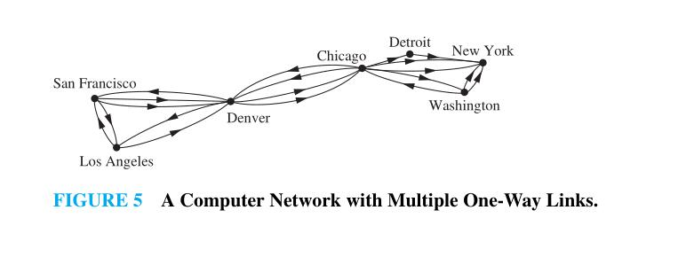
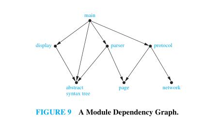
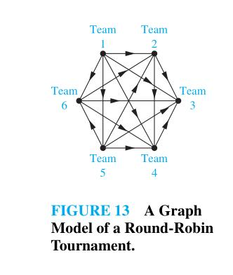
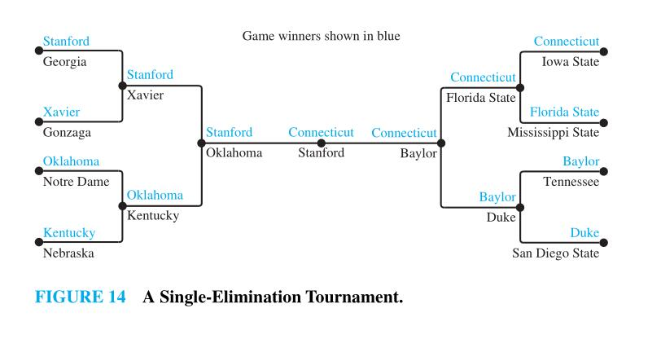

# Graph Models

This mainly includes application-specific graphs.

## COMMUNICATION NETWORKS

We can model different communications networks using vertices to represent devices and edges to represent the particular type of **communications links** of interest. 

## SOFTWARE DESIGN APPLICATIONS 

> NOTE: graph在计算机科学和其他的学科中有着非常广泛的应用，我将此篇作为我总结各种各样的graph model。为什么使用graph来描述问题呢？我觉得图有如下优势：图能够非常好地描述实体(vertex)和实体之间关系(edge)。
>
> 这种关系可能是抽象的dependency，precedence，也可能表示信息/数据/控制的流动/传递/转移（流动/传递/转移也是一种关系）。
>
> - 图能够描述信息/数据/控制的流动/传递/转移，其中流动/传递/转移也是一种关系
> 
>使用图来建模后，很多问题的解决就变得简单了。
> 

Graph models are useful tools in the design of software. We will briefly describe two of these models here.

### [Dependency Graph](https://en.wikipedia.org/wiki/Dependency_graph)

**Module Dependency Graphs** One of the most important tasks in designing software is how to structure a program into different parts,or modules. Understanding how the different modules of a program interact is essential not only for program design, but also for testing and maintenance of the resulting software. A module dependency graph provides a useful tool for understanding how different modules of a program interact. In a program dependency graph, each module is represented by a vertex. There is a directed edge from a module to a second module if the second module depends on the first. An example of a program dependency graph for a web browser is shown in Figure 9.

> NOTE: 使用edge来表示dependency关系，如下是维基百科中关于表达依赖关系的图的文章：
>
> - [Dependency graph](https://en.wikipedia.org/wiki/Dependency_graph)
>
> - [Wait-for graph](https://en.wikipedia.org/wiki/Wait-for_graph)

### [Precedence graph](https://en.wikipedia.org/wiki/Precedence_graph)

**Precedence Graphs and Concurrent Processing** Computer programs can be executed more rapidly by executing certain statements concurrently. It is important not to execute a statement that requires results of statements not yet executed. The dependence of statements on previous statements can be represented by a directed graph. Each statement is represented by a vertex, and there is an edge from one statement to a second statement if the second statement cannot be executed before the first statement. This resulting graph is called a **precedence graph**. A computer program and its graph are displayed in Figure 10. For instance, the graph shows that statement `S5` cannot be executed before statements `S1` , `S2` , and `S4` are executed.

> NOTE: 使用edge来表示precedence关系。precedence关系 VS dependency关系？
>
> [Precedence graph](https://en.wikipedia.org/wiki/Precedence_graph)
>
> [Concurrency control](https://en.wikipedia.org/wiki/Concurrency_control)
>
> [Serializability](https://en.wikipedia.org/wiki/Serializability)
>
> [Serialization](https://en.wikipedia.org/wiki/Serialization)
>
> [Conflict Serializability in DBMS](https://www.geeksforgeeks.org/conflict-serializability-in-dbms/)

> NOTE: 	[Wait-for graph](https://en.wikipedia.org/wiki/Wait-for_graph) vs [Precedence graph](https://en.wikipedia.org/wiki/Precedence_graph)?两者都在concurrent control相关问题中出现，有必要比较一下它们。

### [Control-flow graph](https://en.wikipedia.org/wiki/Control-flow_graph)

> NOTE: 使用edge来表示control的flow

### [Dataflow](https://en.wikipedia.org/wiki/Dataflow)

> NOTE:使用edge来表示data的flow

[Dataflow programming](https://en.wikipedia.org/wiki/Dataflow_programming)

[Data-flow analysis](https://en.wikipedia.org/wiki/Data-flow_analysis)

> [TensorFlow](https://en.wikipedia.org/wiki/TensorFlow): A machine-learning library based on dataflow programming.

在tensorflow中，node表示operation，edge表示tensor，与此类似的有，

## TOURNAMENTS

We now give some examples that show how graphs can also be used to model different kinds of tournaments.

### Round-Robin Tournaments 

A tournament where each team plays every other team exactly once and no ties are allowed is called a **round-robin tournament**. Such tournaments can be modeled using directed graphs where each team is represented by a vertex. Note that `(a,b)` is an edge if team `a` beats team `b`. This graph is a simple directed graph, containing no loops or multiple directed edges (because no two teams play each other more than once). Such a directed graph model is presented in Figure 13. We see that Team 1 is undefeated in this tournament, and Team 3 is winless.

### Single-Elimination Tournaments

A tournament where each contestant is eliminated after one loss is called a single-elimination tournament. Single-elimination tournaments are often used in sports, including tennis championships and the yearly NCAA basketball championship. We can model such a tournament using a vertex to represent each game and a directed edge to connect a game to the next game the winner of this game played in. The graph in Figure 14 represents the games played by the final 16 teams in the 2010 NCAA women’s basketball tournament.

> NOTE: [Bracket (tournament)](https://en.wikipedia.org/wiki/Bracket_(tournament))

## More

更多图模型参见[Application-specific graphs](https://en.wikipedia.org/wiki/Category:Application-specific_graphs)

